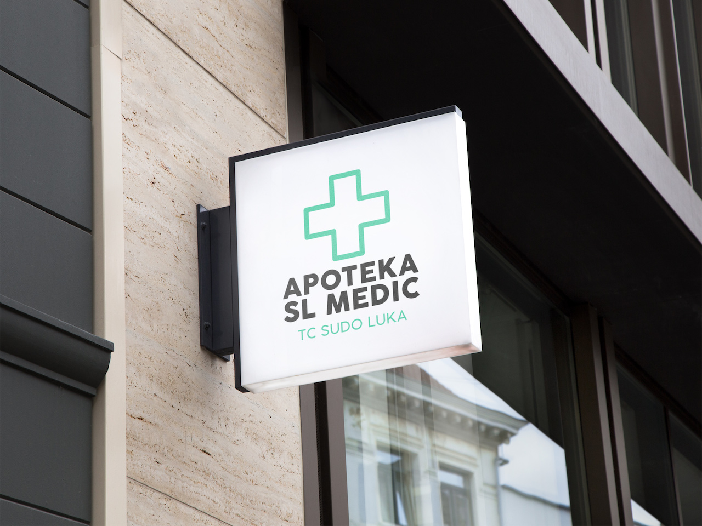

Kreiranje logotipa za kompaniju je uzbudljivo i nagrađujuće iskustvo. Logotip je vizualna predstavacija brenda i vrijednosti kompanije, a često je prva stvar koju potencijalni klijenti vide kada se susretnu sa biznisom. U ovom članku ću vas provesti kroz proces kreiranja logotipa za jednu kompaniju i korake koje sam preduzeo da bih osigurao da konačni dizajn tačno predstavlja njihov brend.

## Korak 1: Istraživanje i razumijevanje brenda

Prvi korak u kreiranju logotipa za kompaniju je istraživanje i razumijevanje brenda. To uključuje učenje o proizvodima i uslugama koje kompanija nudi, njihovoj ciljnoj publici i vrijednostima brenda. Počinjem s provođenjem sesije otkrivanja sa klijentom kako bih razumio njihov biznis, ciljeve i ciljnu publiku. Tokom ove sesije, postavljam pitanja o njihovom brendu, uključujući istoriju kompanije, vrijednosti, misiju i viziju.

## Korak 2: Skiciranje i razmišljanje

Nakon što sam stekao jasno razumijevanje brenda, prelazim na skiciranje i razmišljanje. Počinjem tako što crtam različite ideje i koncepte za logotip. To uključuje stvaranje više grubih skica i varijacija kako bih istražio različite pravce i opcije. Također razmatram konkurente i trendove u industriji kako bih osigurao da logotip se ističe i tačno predstavlja brend.

## Korak 3: Kreiranje digitalnog prototipa

Nakon što sam skicirao nekoliko ideja, biram najbolje koncepte za kreiranje digitalnog prototipa. Koristeći dizajnerski softver, stvaram grub dizajn logotipa kako bih klijentu dao vizuelnu predstavu o tome kako konačni proizvod može izgledati. Također eksperimentišem s različitim shemama boja, tipografijom i grafikama kako bih kreirao jedinstven i efektivan dizajn logotipa.

## Korak 4: Dorada i finalizacija dizajna

Nakon što kreiram digitalni prototip, dijelim ga s klijentom kako bih dobio povratne informacije. Klijent daje povratne informacije o dizajnu, uključujući boje, fontove i ukupni izgled i osjećaj. Na osnovu njihovih povratnih informacija, doradjujem dizajn, prilagođavam fontove, boje i grafike, dok ne dobijem konačni dizajn koji zadovoljava klijenta i predstavlja njihov brend na najbolji mogući način.

## Korak 5: Primjena logotipa

Nakon finalizacije dizajna logotipa, primjenjujem ga na različite materijale i platforme kako bih provjerio kako se logotip prikazuje u različitim situacijama. To uključuje primjenu logotipa na web stranice, vizit karte, promotivne materijale i bannere. Također, provjeravam kako se logotip prikazuje na različitim pozadinama i u različitim veličinama.

## Konačna riječ

Kreiranje logotipa za kompaniju može biti složen proces, ali je i važan korak u izgradnji brenda. Važno je istražiti i razumjeti brend, skicirati i razmišljati o različitim konceptima, kreirati digitalne prototipe i raditi na doradi dizajna sve dok se ne dobije konačni proizvod koji predstavlja brend na najbolji mogući način. Kada se konačni dizajn logotipa odobri, primjenjuje se na različite materijale i platforme kako bi se provjerilo kako se logotip prikazuje u različitim situacijama i kako bi se osiguralo da se brend predstavlja na najbolji mogući način.

